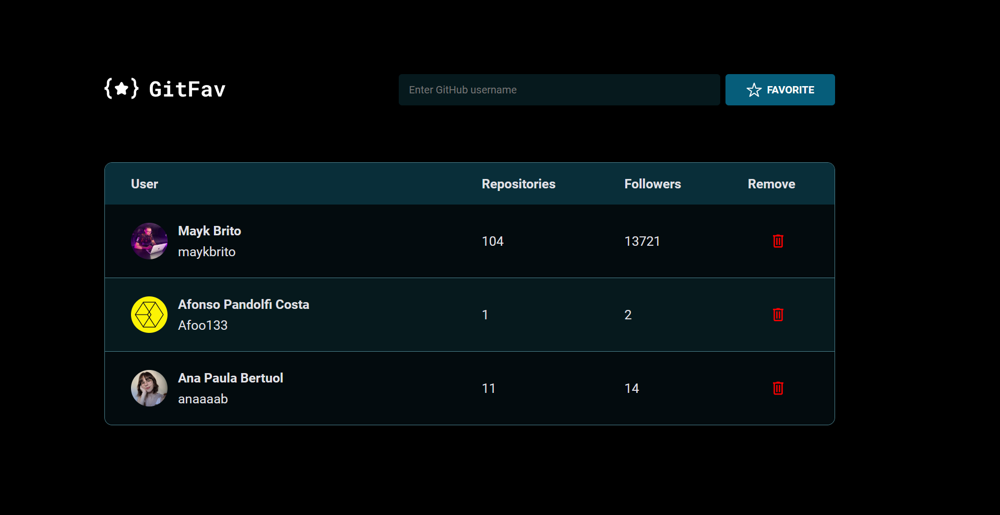

# git-fav ⭐️
  

 Rocketseat challenge, aimed at creating a GitHub favorites page, where it's possible to add or remove favorites, displaying the user, the number of repositories, and followers of the favorite profiles.

The application starts with a blank user list, and it shows on the screen that there are no favorites yet.

If the user tries to add a profile that doesn't exist, they will receive an alert message informing that the user was not found. If they try to add a duplicate profile, they will receive an alert message informing that the user is already registered. If they wish to remove one of the favorite profiles, they will be prompted to confirm if they really want to delete the selected user.

Homepage with no favorite profiles: 

Application with registered favorite profiles:

#

#### <h3 align="center">**This project was developed with** </strong></h3>

#### <h3 align="center">HTML | CSS | JavaScript | Figma | Git | GitHub </h3>

#

#### 
[Access my profile on LinkedIn here](https://www.linkedin.com/in/ana-paula-bertuol/) 
